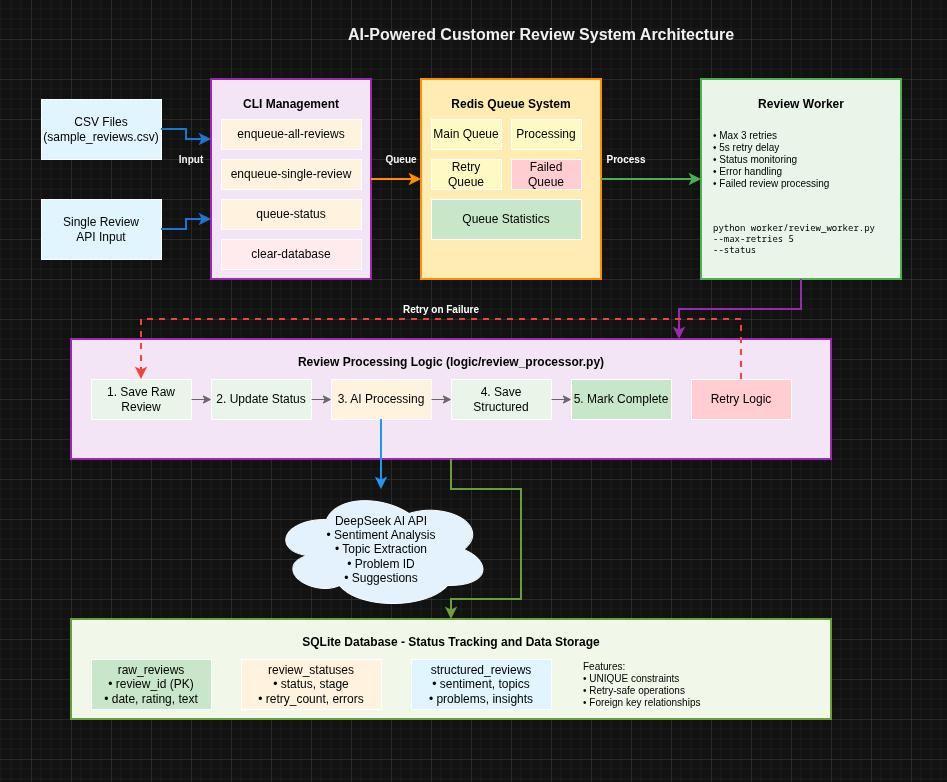
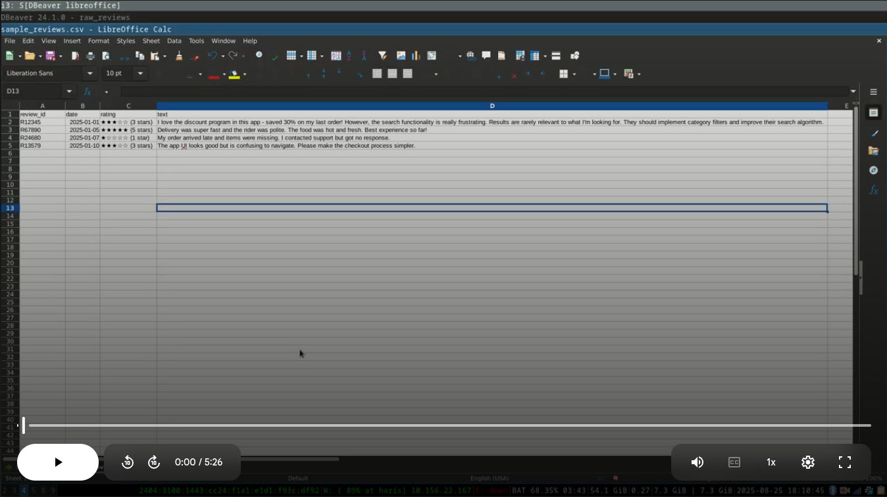

# Customer Review System

AI-powered system for analyzing customer reviews and extracting structured insights.

## 🚀 Quick Start

### 1. Setup
```bash
# Clone and setup
git clone <repository-url>
cd customer-review-system
python -m venv .venv
source .venv/bin/activate  # On Windows: .venv\Scripts\activate
pip install -r requirements.txt
```

### 2. Configuration
Create `.env` file:
```env
DEEPSEEK_API_KEY=your_api_key_here
DEEPSEEK_BASE_URL=https://api.deepseek.com/v1
REDIS_HOST=localhost
REDIS_PORT=6379
```

### 3. Basic Usage

**Enqueue reviews from CSV:**
```bash
python cli/main.py enqueue-all-reviews sample_reviews.csv
```

**Start the worker:**
```bash
python worker/review_worker.py
```

**Check status:**
```bash
python cli/main.py queue-status
```

## 📋 CLI Commands

```bash
# Queue management
python cli/main.py enqueue-all-reviews <csv_file>     # Add reviews from CSV
python cli/main.py enqueue-single-review <id> <date> <rating> <text>  # Add single review
python cli/main.py queue-status                       # Check queue status
python cli/main.py clear-queue                        # Clear all queues

# Database management  
python cli/main.py clear-database                     # Clear all data (requires password)
```

## 🏃‍♂️ Worker Options

```bash
# Basic worker
python worker/review_worker.py

# Worker with custom settings
python worker/review_worker.py --max-retries 5 --retry-delay 10

# Check worker status
python worker/review_worker.py --status

# Process failed reviews manually
python worker/review_worker.py --process-failed
```

## 📊 What It Does

1. **Receives** customer reviews from CSV files or API
2. **Processes** each review using AI to extract:
   - Overall sentiment (positive/negative/neutral)
   - Sentiment score (-1.0 to 1.0)
   - Topics mentioned (delivery, app, product, etc.)
   - Problems identified
   - Suggested improvements
   - Key insights
3. **Stores** structured data in database
4. **Tracks** processing status with retry mechanism

## 🛠️ Architecture

```
CSV Reviews → Redis Queue → Worker → AI Processing → Database
                  ↓
              Status Tracking & Retry Logic
```


- **CLI**: Management commands
- **Worker**: Background processing with retry
- **Logic**: Core processing and AI integration
- **Models**: Database models (raw_reviews, review_statuses, structured_reviews)

## 🔧 Development

**Run tests:**
```bash
pytest
```

**Clear everything:**
```bash
python cli/main.py clear-database --password "YES_DELETE_IT"
python cli/main.py clear-queue
```

## 📁 Project Structure

```
├── cli/              # Command line interface
├── logic/            # Core business logic
├── models/           # Database models  
├── worker/           # Background processing
├── data_files/       # CSV files
├── tests/            # Unit tests
└── examples/         # Usage examples
```

## 🔐 Security

- Database clearing requires password: `YES_DELETE_IT`
- Never commit API keys to version control
- Use `.env` file for sensitive configuration

## 🚨 Troubleshooting

**Redis connection error:**
```bash
# Check if Redis is running
redis-cli ping
```

**API errors:**
- Check DEEPSEEK_API_KEY in `.env`
- Verify API account balance

**Database issues:**
```bash
# Reset everything
python cli/main.py clear-database --password "YES_DELETE_IT"
```

## 📈 Example Workflow

```bash
# 1. Start fresh
python cli/main.py clear-database --password "YES_DELETE_IT"
python cli/main.py clear-queue

# 2. Add reviews
python cli/main.py enqueue-all-reviews sample_reviews.csv

# 3. Check queue
python cli/main.py queue-status

# 4. Start worker (in another terminal)
python worker/review_worker.py

# 5. Monitor progress
python worker/review_worker.py --status
```

The worker will process each review, extract insights using AI, and store structured data in the database with full status tracking and retry capability.

## Scalablity

Run multiple works to process parallel

## Demo Video
[](https://drive.google.com/file/d/1hM6cNTXnRGM59gJACKuTgsV2QyEmofUr/view)